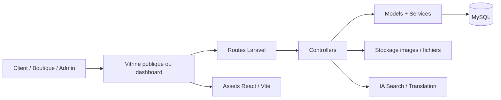
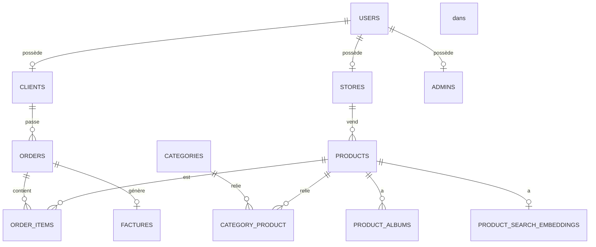

# Présentation du projet Souk AI

## 1. Vue d'ensemble

Souk AI est une plateforme de marketplace digitale pensée pour connecter les boutiques, les clients, les administrateurs et les outils d'intelligence artificielle au sein d'un écosystème commerce moderne.

Le projet regroupe :

- une vitrine publique pour les clients ;
- un tableau de bord sécurisé pour les boutiques et les admins ;
- une gestion avancée du catalogue produit ;
- les commandes, les factures et le suivi des statuts ;
- un système multi-rôles avec contrôle d'accès ;
- des fonctionnalités IA pour la recherche, la traduction et l'expérience utilisateur.

Le produit est conçu pour le marché tunisien et supporte plusieurs langues : français, arabe et anglais.

---

## 2. Objectifs business

Souk AI vise à fournir une plateforme de commerce digital complète, avec les objectifs suivants :

- permettre à chaque boutique de gérer son catalogue ;
- donner aux admins un contrôle centralisé sur les stores, produits, catégories et utilisateurs ;
- offrir une expérience d'achat fluide au client ;
- assurer le suivi des commandes et du stock ;
- intégrer des fonctions d'IA dans la recherche et la découverte de produits ;
- créer une base évolutive pour le commerce intelligent et le commerce circulaire.

---

## 3. Architecture générale

### 3.1 Couche frontend

Le projet utilise deux types d'interfaces :

- la vitrine publique côté Laravel / Blade ;
- le dashboard interne côté React ;
- le build frontend est géré avec Vite.

### 3.2 Couche applicative

Le backend est développé avec Laravel 12 et expose des routes web et API. Les contrôleurs gèrent :

- l'authentification ;
- les produits ;
- les catégories ;
- les commandes ;
- les profils des boutiques ;
- les actions administratives.

### 3.3 Couche données

La base de données est sous MySQL. La structure est construite grâce à des migrations Laravel. Les modèles utilisent Eloquent pour gérer les relations entre utilisateurs, boutiques, produits, commandes, contenu et logs.

---

## 4. Architecture du système

---

## 5. Vitrine publique

La partie publique est orientée client et permet :

- l'accueil et la promotion des produits ;
- la consultation des pages boutique ;
- les pages catégorie ;
- la recherche et le filtrage ;
- le panier et les favoris ;
- le checkout ;
- les pages d'information et d'authentification.

Les routes publiques principales sont :

- / : accueil
- /p/{slug} : détail produit
- /store/{slug} : boutique publique
- /c/{slug} : catégorie
- /search : recherche
- /products, /categories, /stores : listes globales
- /login, /register : authentification

---

## 6. Dashboard interne

Le dashboard est une application React intégrée dans Laravel. Il est utilisé pour les gestionnaires et les vendeurs.

### Rôles disponibles

- Admin : gestion globale de la plateforme
- Store : gestion de sa boutique et de son catalogue
- Client : achat et suivi
- Autres rôles métiers comme influenceur ou logistique selon la logique du projet

### Pages principales du dashboard

- /dashboard
- /dashboard/products
- /dashboard/products/:id
- /dashboard/products/create
- /dashboard/orders
- /dashboard/stores
- /dashboard/stores/:id
- /dashboard/categories
- /dashboard/profile

---

## 7. Modules fonctionnels

### 7.1 Gestion des utilisateurs et rôles

L'entité centrale est la table users. Elle contient les informations d'identité et le rôle utilisateur.

Les rôles incluent :

- CLIENT
- INFLUENCER
- STORE
- ADMIN
- SHIPPING_COMPANY
- SHIPPING_EMP

Cela permet d'avoir un système unique, modulable et sécurisé.

### 7.2 Gestion des boutiques

Une boutique est un profil lié à un utilisateur. Elle contient :

- nom en français, arabe et anglais ;
- description multilingue ;
- téléphone ;
- adresse ;
- logo et couverture ;
- slug ;
- statut actif/inactif ;
- informations fiscales.

### 7.3 Catalogue produits

Le produit est l'objet central du commerce. Il contient :

- nom et description en plusieurs langues ;
- prix ;
- stock ;
- slug ;
- remise / promo ;
- actif/inactif ;
- catégories associées ;
- images du produit.

### 7.4 Commandes et factures

Le système prend en charge :

- les commandes clients ;
- les produits commandés ;
- le montant total ;
- les statuts ;
- les factures associées.

### 7.5 Notifications, avis et modération

Le schéma prend aussi en charge :

- commentaires ;
- notes ;
- signalements ;
- listes de blocage ;
- notifications ;
- logs d'activité.

### 7.6 IA et recherche intelligente

Le projet intègre :

- embeddings pour la recherche sémantique ;
- traduction automatique ;
- remplissage assisté de contenu ;
- préparation future pour recommandations et analyses avancées.

---

## 8. Schéma de base de données

Les tables principales sont :

### Tables centrales

- users
- clients
- stores
- admins
- categories
- products

### Tables commerce

- orders
- order_items
- factures

### Tables média et contenu

- product_albums
- pages
- page_images
- contact_settings

### Tables système

- sessions
- dashboard_sessions
- personal_access_tokens
- settings
- jobs
- cache
- cache_locks

### Tables de modération et support

- notifications
- reports
- block_lists
- comments
- ratings
- logs

---

## 9. Relations entre entités

---

## 10. Exemple de flux fonctionnel

### Parcours client

1. le client visite la marketplace ;
2. il consulte les produits et boutiques ;
3. il ajoute des articles au panier ;
4. il confirme la commande ;
5. le backend enregistre la commande et la facture.

### Parcours boutique

1. le vendeur se connecte au dashboard ;
2. il configure son profil boutique ;
3. il ajoute ses produits ;
4. il vérifie les commandes et le stock ;
5. il pilote son activité depuis l'interface interne.

### Parcours admin

1. l'admin accède au dashboard ;
2. il gère les magasins, produits et utilisateurs ;
3. il valide ou supervise les opérations ;
4. il contrôle la plateforme et les contenus.

---

## 11. Sécurité et droits d'accès

Le projet sépare les accès selon les rôles. Cela permet :

- de protéger les pages publiques et les dashboards ;
- de limiter l'accès API selon le niveau d'autorisation ;
- d'isoler les actions entre boutiques ;
- de sécuriser les opérations sensibles comme les commandes et la gestion des comptes.

---

## 12. Points forts du projet

- architecture modulaire et évolutive ;
- base logicielle moderne avec Laravel + React ;
- support multilingue ;
- gestion avancée du catalogue ;
- séparation claire entre vitrine publique et dashboard interne ;
- préparation à l'IA et à la personnalisation ;
- forte logique métier orientée commerce.

---

## 13. Axes d'amélioration

Le projet est déjà solide et peut évoluer vers :

- moteur de recommandation produit ;
- paiement en ligne ;
- livraison et logistique ;
- gestion des retours ;
- analytics avancées ;
- commerce social et influenceurs ;
- intégration marketing et CRM.

---

## 14. Résumé de présentation

Souk AI est une solution de marketplace moderne, conçue pour le commerce digital tunisien. Elle combine une vitrine publique pour les clients et un dashboard interne pour les boutiques et les administrateurs. L'architecture repose sur Laravel pour le backend, React pour le dashboard, MySQL pour le stockage des données, et des services d'IA pour améliorer la découverte, la traduction et l'expérience utilisateur. Le projet est conçu pour être scalable, multi-rôles, multilingue et prêt pour la croissance future.

---

## 15. Conclusion

Souk AI est plus qu'un simple site e-commerce : c'est une plateforme de commerce digital complète, pensée pour gérer des boutiques, des produits, des commandes, des contenus et des utilisateurs dans un seul système. Il s'agit d'une base solide et professionnelle pour un projet de marketplace moderne et intelligent.

**© 2026 Souk AI**
